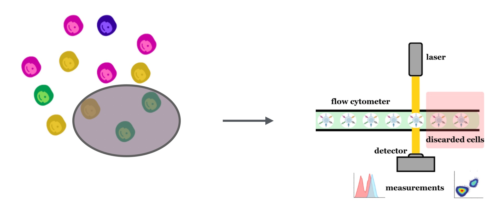
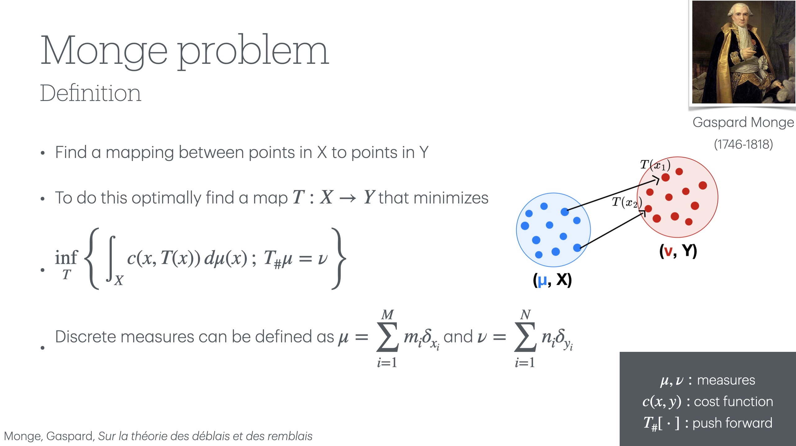
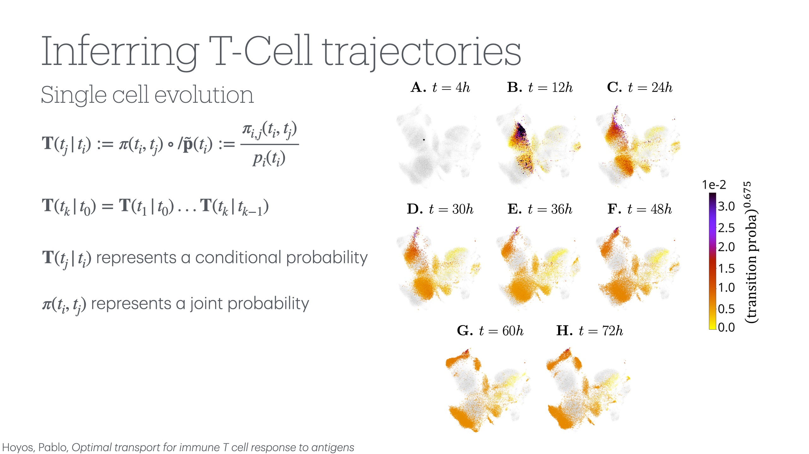
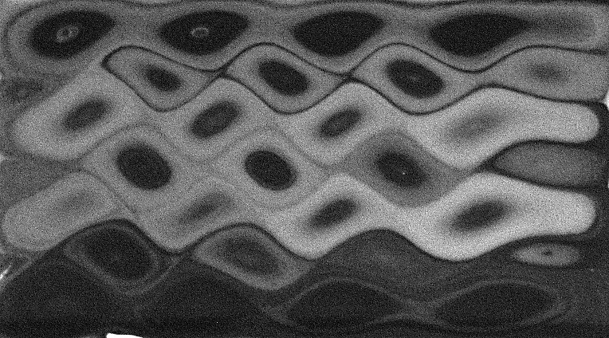

I am a graduate student in the Department of Physics at the University of Washington in Seattle. I am generally interested in dynamics systems and biophysics as well as fluid dynamics and turbulence. Currently, I am working on applying Optimal Transport (OT) and machine learning (ML) methods to studying the immune system given data about surface protein epxression of T-cells in the presence of specific antigens. More specifically I am working on extending our existing algorithm using static OT to be spatially and temporally continuous using dynamic OT and variational autoencoders. My talk summarizing the application of static OT to studying T-cells and the vision for converting to a continuous space is summarized the slides linked [here](https://github.com/darin-momayezi/Project-Portfolio/blob/main/OptimalTransportpdf.pdf). My previous research on finding data-driven equations of motion for inertial particles in turbulent fluids can be found [here](https://github.com/darin-momayezi/Anisotropic-Particles/blob/main/Model_Discovery_of_Particles_in_Fluid_Flows.pdf). 

